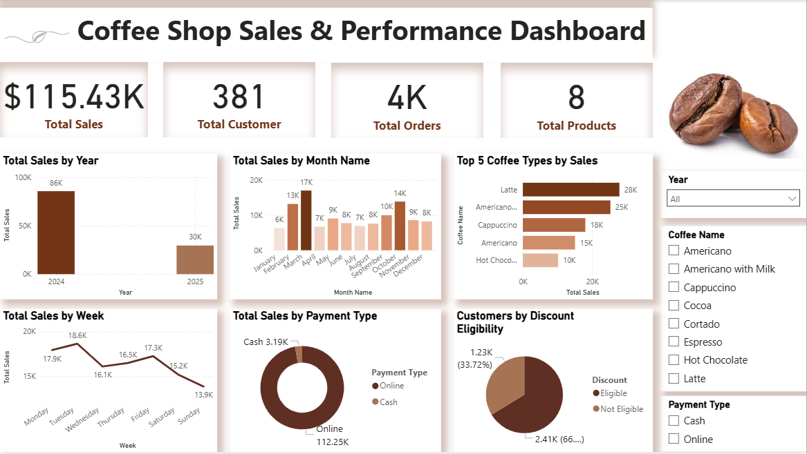

# Power BI Coffee Shop Dashboard – Sales & Performance Analysis

An interactive **Power BI dashboard** analyzing sales performance, customer behavior, and product trends for a coffee shop. This project showcases my skills in **data visualization, analytics, and storytelling** using real-world data.

---

## 📖 Overview
This dashboard provides a **comprehensive view of a coffee shop’s sales and operations**, helping stakeholders track performance and identify opportunities.  

Key objectives:
- Analyze sales by **product type**, **payment method**, and **customer segments**.  
- Identify **top-selling products** and **seasonal sales trends**.  
- Visualize **monthly and yearly performance** for decision-making.

---

## 📊 Features
- **KPI Cards**: Total Sales, Orders, Customers & Products.  
- **Sales Trends**: Yearly, monthly, and weekly breakdowns.  
- **Product Insights**: Top coffee types by revenue.  
- **Payment Analysis**: Cash vs. Card transactions.  
- **Customer Segmentation**: Discount eligibility breakdown.  
- **Interactive Filters**: Year, Coffee Type, and Payment Type for deeper analysis.

---

## 🔗 Dataset
This dashboard is built using the **Coffee Sales dataset** from Kaggle:  
[View Dataset on Kaggle](https://www.kaggle.com/datasets/ihelon/coffee-sales)

*Dataset is not included in this repository to respect licensing.*

---

## 🛠 Tools Used
- **Power BI** – Data visualization & dashboard creation  
- **Excel** – Data cleaning and preprocessing  

---

## 🚀 How to Use
1. Download the `.pbix` file from this repository.  
2. Open it in **Power BI Desktop**.  
3. Interact with filters and visuals to explore insights.

---

## 📌 Key Insights
- **Latte** leads as the top-selling coffee type (28K sales).  
- **April** shows the highest sales across all months (17K).  
- **Online (Card) payments** dominate over cash transactions.  
- A significant portion of customers are **eligible for discounts**, indicating potential promotional opportunities.  

---

 
